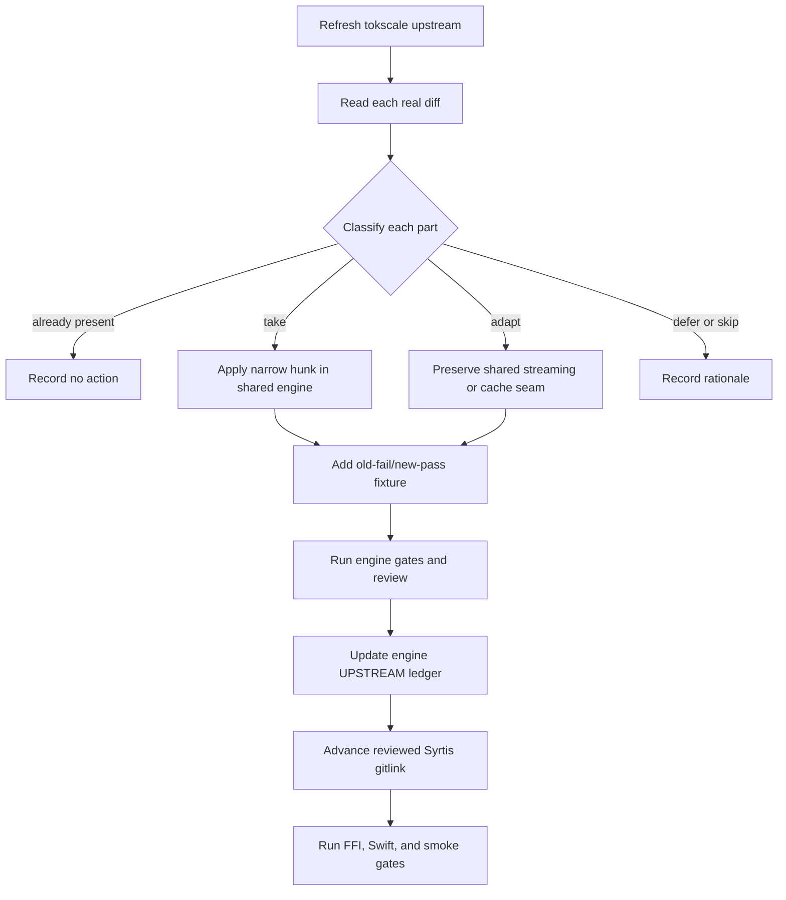

# Shared tokscale engine alignment

## 文件目的

Syrtis consumes the public [`tokscale-core`](https://github.com/Nanako0129/tokscale-core) engine through the pinned `vendor/tokscale-core` submodule. This document explains the consumer boundary and the method for safely aligning the shared engine. The exact upstream baseline, commit table, local patch table, and upstream report numbers for Syrtis's current reviewed pin live in the engine's immutable [`UPSTREAM.md`](https://github.com/Nanako0129/tokscale-core/blob/8fc63cedfaf4aeec73c9a4e65711c280e7add15e/UPSTREAM.md); [`vendor/README.md`](../../vendor/README.md) records Syrtis's source and pin. Newer engine work is not part of Syrtis until a separate consumer change advances that gitlink and passes the consumer gates.

## 目錄

- [Current boundary](#current-boundary)
- [Selective-port method](#selective-port-method)
- [Shared adaptation families](#shared-adaptation-families)
- [Schema and parser output](#schema-and-parser-output)
- [Sibling-source rule](#sibling-source-rule)
- [Upstream alignment](#upstream-alignment)
- [Handoff checklist](#handoff-checklist)

---

## Current boundary

The engine's true baseline is recorded in `tokscale-core/UPSTREAM.md`; the Cargo package version is not a reliable baseline marker. The shared tree contains upstream cherry-picks plus streaming, cache, report, pricing, and defensive adaptations extracted from Syrtis. Syrtis keeps its application-specific FFI, C ABI, Swift, and build wiring outside the submodule.

> **不要在 consumer branch 直接改 submodule source。** Shared Rust changes first land and pass review in `tokscale-core`; Syrtis then advances only the reviewed gitlink and runs its consumer gates. A clean build alone cannot prove that streaming or cache semantics were preserved.

Native 現在 pin reviewed engine commit `8fc63cedfaf4aeec73c9a4e65711c280e7add15e`，即 engine 的 `main`。自上一個發版 pin `319ffa8` 起的推進（20 個 first-parent merge、共 70 個 engine commit）大多來自 2026-10-02 的上游同步，逐項處置與實測記在 engine 的 `UPSTREAM.md`。

| 類別 | engine PR | 內容 | 快取 |
|---|---|---|---|
| 新 client | [#49](https://github.com/Nanako0129/tokscale-core/pull/49) `zcode`、[#50](https://github.com/Nanako0129/tokscale-core/pull/50) `augment`、[#54](https://github.com/Nanako0129/tokscale-core/pull/54) `hindsight`、[#57](https://github.com/Nanako0129/tokscale-core/pull/57) `muse`、[#58](https://github.com/Nanako0129/tokscale-core/pull/58) `reasonix`、[#60](https://github.com/Nanako0129/tokscale-core/pull/60) `kimchi`、[#61](https://github.com/Nanako0129/tokscale-core/pull/61) `senpi` | 各自的新 `ClientId` 與 parser；ZCode 只讀 v2 SQLite（`~/.zcode/cli/db/db.sqlite`，含 `-wal`），provider 為 `zhipu`；Kimchi（`$KIMCHI_CODING_AGENT_DIR/sessions`，預設 `~/.config/kimchi/harness/sessions`）與 Senpi（`$SENPI_CODING_AGENT_DIR/sessions`，預設 `~/.senpi/agent/sessions`，只讀 base client）共用 Pi 格式 parser | 新 namespace 的 `parser_version` 從 1 起，既有 namespace 不受影響 |
| 新 client，自 Pi 拆出 | [#62](https://github.com/Nanako0129/tokscale-core/pull/62) `omp`（Oh My Pi） | `~/.omp/agent/sessions` 原本由 `pi` client 掃描，現在歸新的 `omp` client；`pi` 不再推導這個根目錄。`RESOLVER_CONTRACT_VERSION` 2→3 | `parser_version(Pi)` 2→3：Pi 的 parse 本身不變，bump 是為了讓先前以 Pi 身分快取的 `~/.omp` 檔案作廢，升級後 `~/.pi` 首次掃描會重新 parse 一次；`omp` 從 1 起 |
| 既有 client | [#56](https://github.com/Nanako0129/tokscale-core/pull/56) Kimi Work | Kimi 桌面 app 內嵌的 Kimi Code session 加入 `kimi` 的掃描根目錄，不是新 id；`RESOLVER_CONTRACT_VERSION` 1→2 | 不重掃既有檔 |
| 既有 client | [#51](https://github.com/Nanako0129/tokscale-core/pull/51) Kiro credits | 帶 credits 的訊息改為 provider-reported cost（每 credit $0.04），逐輪記在發生的那一輪；`message_count` 取實際 request 數 | `parser_version(Kiro)` 1→2，升級後 Kiro namespace 重新 parse 一次 |
| 既有 client | [#47](https://github.com/Nanako0129/tokscale-core/pull/47) Pi | 開頭帶 UTF-8 BOM 的 Pi transcript 不再整檔丟失 | 不 bump：舊 parse 為 0 則，空結果本來就不進快取 |
| 定價 | [#48](https://github.com/Nanako0129/tokscale-core/pull/48) [#52](https://github.com/Nanako0129/tokscale-core/pull/52) [#53](https://github.com/Nanako0129/tokscale-core/pull/53) [#55](https://github.com/Nanako0129/tokscale-core/pull/55) [#59](https://github.com/Nanako0129/tokscale-core/pull/59) | Kimi／Daybreak／Cursor-tier 別名；GPT-5.6／GPT-6 超過 272K 整筆計價；OpenRouter 改存作者的 standard tier；Composer 2 cache write 標為免費、`claude-opus-41`／`claude-sonnet-4-0` 別名；provider hint 選到缺 272K 層的列時從 canonical 列補層 | 皆在快取之後計價，不 bump |
| 記憶體 | [#63](https://github.com/Nanako0129/tokscale-core/pull/63) lazy cache namespaces、[#64](https://github.com/Nanako0129/tokscale-core/pull/64) 文件 | 串流報表路徑不再一開始就載入所有 namespace 的快取：每個 lane 第一次查詢前才載入自己的 namespace，用完即釋放其中未修改的項目（Claude 從不釋放；Codex 在所有 chunk 的 stage B 之後才釋放）。只改記憶體，輸出不變。engine PR #63 在維護者語料上量的暖快取 peak RSS：全部 client −8.2%（329.0→301.9 MiB），只看單一 client 時 cursor −88%、claude −32%、codex −29%；冷掃描不變（兩個 head 皆 629–662 MiB）。全部 client 只降 8.2%，因為 Claude lane 先跑且不釋放，Codex lane 期間兩個大 namespace 同時常駐；使用者已放寬原本約 10% 的門檻。Syrtis 端驗收（凍結 pricing、維護者語料，每條路徑依序跑四輪：舊 pin `6712ed8` 建快取 → 新 pin 暖升級 → 新 pin 冷快取 → 舊 pin 冷快取）：串流路徑以 `get_model_report`（`scan_messages_streaming`，與 graph／hourly／agents／window 報表同一條）量測 67 列；materialized 路徑以 `parse_local_clients`（eager `load()` ＋ `prune_missing_files()`，#63 重構過其讀取與 prune；FFI 的 `usage_tail`、`tb_probe` 走這條）依 client／provider／model 彙總 token 與訊息數，量測 68 列；在 `parse_local_clients` 裡只有 Claude 經由 source cache 讀取，其餘 client 直接 parse，所以這輪只對 14 列 Claude 有證明力（其中 13 列四輪逐位元相同，另 1 列是量測期間仍在寫入的 transcript）。兩條路徑上，兩個 pin 的輸出除了量測期間仍在寫入的 session 之外逐列相同；那些列在每個欄位上都隨執行先後單調增加、與哪個 pin 無關（舊 pin 最後跑，數字最大）。⚠️ 待決（A1，engine `UPSTREAM.md` 記錄）：串流路徑現在只 prune 本次掃描載入的 namespace，被篩掉或已無來源的 client，其已刪檔案的快取項會留在磁碟，直到某次掃描載入它；這些項目不會被讀到，只佔磁碟 | 不 bump：`CACHE_FORMAT_VERSION` 與所有 `parser_version` 不變 |
| 掃描 | [#65](https://github.com/Nanako0129/tokscale-core/pull/65) scan exclusions | `ScannerSettings.excluded_scan_paths` 先前只在 context-free 掃描生效，所有 `*_with_source_context` 報表、parse 與 change token 走的 `scan_all_clients_resolved_inner` 忽略它；現在兩條掃描路徑都在 `run_scan_tasks` 前套用同一個 `retain_unexcluded_scan_tasks`。捕獲的 context 把相對 exclusion 綁到 capture cwd，remote context 要求 exclusion 為絕對路徑，有效 exclusion 以 field 16 進入 context identity（沒有 exclusion 時不編碼，所以沒設 exclusion 的 identity 與先前逐位元相同，`RESOLVER_CONTRACT_VERSION` 維持 3）。Syrtis 端：`tb_core_ffi` 沒有任何地方建立 `ResolvedLocalSourceContext`，Claude 多帳號視窗（`window_usage.rs`）走 context-free 的 `get_window_usage`、本來就套用 exclusion，所以沒有行為變化；本機 `~/.config/tokscale/settings.json` 的 `scanner` 沒有 exclusion。Syrtis 端驗收（凍結 pricing，每條路徑依序四輪外加一輪同 pin 暖快取：舊 pin `726efd7` 建快取 → 新 pin 暖升級 → 新 pin 暖（同 pin）→ 新 pin 冷 → 舊 pin 冷）：串流 `get_model_report` 67 列、materialized `parse_local_clients` 68 列，五輪輸出逐列相同，唯一的差異是量測期間仍在寫入的 Claude session（`claude-opus-5-5`、`claude-sonnet-5-5`），數字隨執行先後單調增加、與 pin 無關 | 不 bump：`CACHE_FORMAT_VERSION`、所有 `parser_version`、`RESOLVER_CONTRACT_VERSION` 皆不變，不需重掃 |
| 既有 client | [#67](https://github.com/Nanako0129/tokscale-core/pull/67) Cursor usage-events JSON | 上游 tokscale CLI 現在把 Cursor 快取寫成 `usage.json`／`usage.<account>.json`（dashboard `get-filtered-usage-events` 的回應），這個 tree 先前只讀 `usage*.csv`，只用新版 CLI 的使用者看不到任何 Cursor 用量。移植上游 #1247 的 parser 與 #1397 的 parser 半邊：掃描 pattern 改為 `usage*.json\|usage*.csv`（archive、`usage.backup*` 與 `usage.last-sync-attempt` 之類非用量檔仍排除）；同一目錄同一 stem 時 JSON 勝出、CSV 不計；cost 取 `tokenUsage.totalCents`，沒有時取 `chargedCents`，除以 100、標為 provider-reported。Syrtis 端：Cursor desktop sync（C2）寫出的 `usage.<hmac>.json` 就是由這個 parser 讀取。⚠️ source-context descriptor 含掃描 pattern，engine 的 descriptor golden 因此改變（macOS `85f904fd…`）：先前為遠端配對核准過的 scope 不再相符、需重新核准；配對尚未出貨，沒有使用者受影響 | 不 bump：Cursor `parser_version` 維持 3（CSV parse 不變，快取以路徑為鍵，新的 JSON 路徑沒有舊項目可過期）；`CACHE_FORMAT_VERSION`、`RESOLVER_CONTRACT_VERSION` 不變 |

`CACHE_FORMAT_VERSION` 維持 4；既有 namespace 只有 Kiro（1→2）與 Pi（2→3）前進 `parser_version`。`RESOLVER_CONTRACT_VERSION` 合計 1→3（#56、#62）；在這個 tree 裡 source-context identity 沒有正式消費者，Syrtis 看不到這項變化。**對 macOS 不只是 pin-only**：`crates/tb_core_ffi` 與 header 新增 additive 的 `tb_client_ids`，既有簽名都沒動（見 [`architecture.md`](architecture.md#windows-downstream-consumer)），SelfTest 用它斷言 engine 的每個 client id 都已在 `ClientRegistry` 註冊——`AppDelegate.effectivePublished` 與 `DiscordPresence.selectableClients` 只保留已註冊的 id，沒註冊的 client 用量會無聲消失，`omp` 就是這種情形。Swift 端在 `ClientRegistry`（名稱與顏色取自上游 `packages/frontend/src/lib/constants.ts` @ `fe72e1f9`；上游給 `reasonix`、`kimchi`、`omp` 的顏色分別與既有的 `antigravity-cli`、`goose`、`gjc` 相同，改用與所有已註冊顏色 ΔE76 ≥ 22 的替代色，SelfTest 斷言新 id 不與任何 client 同色）、`AgentIconView`／`IconGalleryView`（維護者確認過的官方 icon）與 SelfTest 加入新 id。新 client 的訂閱對應未查證，未加入 `UsageAttributionSettings`（見 [`architecture.md`](architecture.md#usage-attribution)）。Hindsight 只讀上游 tokscale CLI 寫出的用量檔，engine 與 Syrtis 都不寫入：使用者必須自行安裝上游 CLI 並定期執行 `tokscale hindsight sync`，Syrtis 才看得到 Hindsight 用量。

⚠️ **使用者會看到**：GPT-5.6／GPT-6 的長請求（input＋cache read 超過 272K）改按整筆長 context 費率計；OpenRouter 價格改用作者的 standard tier（先前存的是半價的 Flex，`gpt-6-astra` 等 31 個模型的 OpenRouter 價因此加倍，`gpt-5.6-sol-pro` 因列價等於 fast tier 變為 standard 的 2 倍，是已知例外）；provider hint 選到缺 272K 層的列時改照 canonical 列計價。Kiro 帶 credits 的訊息改顯示 credits 換算的費用，升級後第一次掃描會因 Kiro 與 Pi 重新 parse 而稍慢。新 client 的用量出現在各自的分頁。**Oh My Pi 的用量從 Pi 改歸 `omp`**：Pi 分頁的歷史會下降、Oh My Pi 分頁出現同等的量。兩個目錄沒有共同紀錄時總量不變；同一筆紀錄同時存在 `~/.pi` 與 `~/.omp` 時（例如複製過去的 session），以前在單一 `pi` lane 裡只算一次，現在 `pi` 與 `omp` 各算一次（engine 刻意不做跨 client 去重，與上游相同），總量會上升。**實測**（維護者機器，model report，凍結 pricing 副本、`TOKSCALE_PRICING_CACHE_ONLY=1`；先以舊 pin `319ffa8` 建快取，再以新 pin 對同一個 config dir 跑暖升級、對全新 config dir 跑冷快取）：在 `6712ed8` 重跑：67 列 token 全部守恆，暖升級與冷快取逐列相同（唯一差異是量測期間仍在寫入的 Claude `claude-opus-5-5` transcript，三次依序執行時單調增長）；費用變動的只有 4 列——Claude Code `gpt-5.6-sol` $355.25→$449.17（+26.44%）、Codex `gpt-5.6-sol` $5,901.37→$6,397.37（+8.40%）、Codex `gpt-6-astra` $196.53→$320.60、OpenCode `gpt-5.4` $79.94→$86.29。OpenRouter standard tier 的修正發生在抓取價格的那一步，這次比對的兩個 pin 讀同一份價格檔，所以不在上面四列裡：engine PR #53 以 live 抓取比對，319 個模型中 32 個不同，本機只有 `gpt-6-astra` 一列受影響（Claude Code $5.91→$11.82、Codex $98.27→$196.53，各 +100%）。本機沒有 ZCode、Augment、Hindsight、Muse、Reasonix、Kimchi、Senpi、Pi、Oh My Pi、Kiro 或 Kimi Work 的資料，這些只有 engine 的 hermetic 測試與 mutation 檢查覆蓋。Kiro 的 credits 費用不會觸發 `implausibleCostRatio`：每 credit $0.04，遠低於同一輪 token 的牌價估算，而那個守衛只看偏高的方向（推算，未實測）。

**FFI 估算（記錄，未修改）**：`crates/tb_core_ffi/src/model_report.rs` 的 `local_cost_estimate` 以 model report 一列**彙總後**的 token 帶 provider hint 重新估價，所以整筆 272K 規則會套在彙總量上。不帶 hint 的 LiteLLM `gpt-5.4` 列本來就是這樣；engine PR #59 讓帶 hint 的 OpenRouter `gpt-6-astra` 列也落入，其彙總估算約由 $196.53 變為 $385.76。這個值只是 `implausibleCostRatio` 的分母、不顯示給使用者，高估只會讓警示更安靜。

前次推進（至 `319ffa8ca75f6cd2bfaf96ae0d295a8fa618ec2c`，3 個 first-parent merge、共 12 個 engine commit）只有一項行為變更：engine PR [#46](https://github.com/Nanako0129/tokscale-core/pull/46) 在報表分組的 alias fold（`ModelAliasResolver::apply`）加了一條內建規則，把 Grok Build 的 `grok-<version>-build` 併進 `grok-<version>`（issue [#118](https://github.com/Nanako0129/syrtis/issues/118)）。Grok Build 以 `grok-<version>-build` 為每輪 usage 的 `modelUsage` key，同一個 session 的 metadata 卻寫 `grok-<version>`，同一個模型的歷史因此拆成兩列。版本必須是以點分隔、非空的數字段；`grok-unknown`、`grok-4.5-build-preview`、`grok-4.5-mini-build` 與其他 `-build` 名稱都不動；使用者設定的 alias 若以原始 `-build` 名稱為 key，仍優先於這條規則。它只作用在 model／monthly／hourly 報表的分組：逐則訊息的定價、快取身分、`canonical_model_id`、graph `ClientContribution` key 與 window usage 列都維持原始 id，因此 `CACHE_FORMAT_VERSION` 維持 4、所有 `parser_version` 不變、不重掃。另外兩個 merge 不改行為：PR [#44](https://github.com/Nanako0129/tokscale-core/pull/44) 更正 `UPSTREAM.md` 裡 OpenRouter 分隔符修正的量測敘述，PR #41 只動審查設定。

**該次 Syrtis 端隨行變更**：graph payload 以原始 `canonical_model_id` 作 key，所以 graph 衍生的 model 分組必須自己套同一條規則，否則會和已分組的 Models 畫面不一致。`Sources/TokenBarCore/ModelGrouping.swift` 的 `ModelGrouping.groupID` 套在 `DayBars`（model 模式）、Monthly／Daily 的 model slices、`AttributedDailySeries` 的分組 key，`QuotaHistoryFold` 的每模型顯示明細，以及 `ModelColorMap` 的建表與查表 key。用於比對的地方維持原始 id：`ModelScope.covers`、`QuotaHistoryFold` 的 scope 與歸屬判定、`UsageAttribution` 紀錄；live tail 的 `UsageTrace` 本來就顯示未經正規化的原始 id，不在這次範圍內。兩邊由同一份 `Tests/fixtures/model-grouping-cases.json`（17 列）綁在一起：`crates/tb_core_ffi` 的 `model_grouping_cases_match_the_engine` 拿它對 engine 的 `normalize_model_for_grouping` 驗證，SelfTest 拿它對 `ModelGrouping.groupID` 驗證，兩邊都先斷言檔案存在且至少 17 列。FFI 的 `local_cost_estimate` 會以分組後的名稱重新估價；實測 `grok-4.5-build`、`grok-4.6-build`、`grok-4.7-build` 解析到的價格條目都和各自的裸名相同，其他版本沒有量過。`ctb.h` 與 FFI production code 不變。

⚠️ **該次使用者會看到**：Grok Build 的用量合併成一列、一段、一個顏色的 `grok-<version>`，總量不變。**實測**（維護者機器，經出貨中的 FFI `tb_model_report`／`tb_hourly_report`，live home、隔離 config dir、同一份凍結 pricing cache）：grok model 列 5→3（`grok-4.6` 為 196＋1＝197 則、`grok-4.7` 為 22＋1＝23 則），grok 的 input、output、cache read、reasoning、messages 與 cost（$749.486128）前後逐位元相同；`cost / costEstimate` 最高 3.03（門檻 50），沒有列新增警示；hourly 1,494 列中 64 列只有 `models` 清單改名。量測時 engine 在 `1af58c2`；之後兩項審查修正（先查原始名稱的 alias、拒絕畸形版本號）在沒有安裝 alias、也沒有畸形 id 的資料上不改變結果。非 grok 的差異只有量測期間仍在寫入的 Claude transcript。

前次推進（至 `bb9a2a9ac787344bb4bd3120d645208217b21016`）帶進三個修正（3 個 first-parent merge、共 13 個 engine commit）：Pi 分支／fork 複製父 session 逐字寫進新檔的助理紀錄（同一個 `responseId`、entry id 與 usage）先前沒有任何 dedup key，每份複製都各自計數一次；`parse_pi_file` 現在發出跨 session 的 key `pi:response:<provider>:<responseId>`（PR [#42](https://github.com/Nanako0129/tokscale-core/pull/42)，上游 #1323／issue #1306），`parser_version(Pi)` 1→2。Droid 的 `*.settings.json` 只帶一個 session 累計的 `tokenUsage`，先前整筆記在 `providerLockTimestamp`（供應商被*選定*的時刻，不是 token 花費的時刻），現在依 sibling `*.jsonl` transcript 逐則 reply 的 context／output 權重按比例拆分，時間錨點改成 settings 檔的 mtime（下限鎖在 lock timestamp，防止倒退的 mtime 早於供應商選定）（PR [#43](https://github.com/Nanako0129/tokscale-core/pull/43)，上游 #1120），`parser_version(Droid)` 1→2（vendor-local 編號，不承接上游的 7）。OpenRouter 把 minor version 拼成點號（`claude-haiku-4.5`），LiteLLM 與呼叫端拼成連字號（`claude-haiku-4-5`），provider-scoped exact 與 fuzzy 兩個比對階段先前都只比對原始拼法，於是帶 provider hint 時 OpenRouter 的第一方定價從未進入 arbitration；`exact_or_normalized_openrouter_for_provider` 與 `fuzzy_match_openrouter` 現在補上標準化重試（PR [#30](https://github.com/Nanako0129/tokscale-core/pull/30)，我方回報 [#1329](https://github.com/junhoyeo/tokscale/issues/1329)、上游修正 [#1338](https://github.com/junhoyeo/tokscale/pull/1338) 原封不動移植），不動 `parser_version` 也不動快取格式，純定價修正。**快取**：`CACHE_FORMAT_VERSION` 維持 4；三項修正只有 Pi、Droid 前進 `parser_version`，其餘 client 不變。**對 macOS 是 pin-only**：`crates/tb_core_ffi` 零改動、`ctb.h` 簽名不變。⚠️ **使用者會看到**：用過 Pi 分支／fork 的使用者，原本重複計數的複製訊息在下次解析後只算一次；用過 Droid 的使用者，原本一次性算在 session 最早時刻的用量，改成依實際發生時間分散在各則 reply 上；透過 OpenRouter 解析、model 名以點號分 minor version 的整個 Claude haiku／opus／sonnet／fable 家族（`claude-opus-5`、`claude-sonnet-5` 因兩邊拼法剛好一致而不受影響）定價路徑改變；升級後第一次掃描會因 Pi、Droid 兩個 namespace 重新 parse 而稍慢。Pi 與 Droid 的修正沒有以本機 session 資料量測，只有 engine 的 hermetic 測試與 mutation 檢查覆蓋。OpenRouter 修正有實測（2026-09-27，維護者語料，model report、隔離 config dir、同一份凍結 pricing cache、`TOKSCALE_PRICING_CACHE_ONLY=1`）：66 筆 client/provider/model 列的 token 全部相同，4 列費用改變。`claude-fable-5-1` 與 `claude-opus-5-5` 各 −16.67%：舊 pin 比不到 OpenRouter 的點號拼法，provider-scoped LiteLLM 落到 `bedrock/us-gov-east-1/anthropic.*` 條目，每項費率都是 list price 的 1.2 倍；新 pin 由 OpenRouter 的第一方條目勝出。`claude-opus-4-8` +1.04% 與 opencode 的 `claude-haiku-4-5` +2.43%，是原本以 $0 計的 cache write 補上費率。1h cache-write 加價不受影響（`compute_cost` 不看比對來源）。Windows x64 語料同形。`UPSTREAM.md` 先前記的「66 筆沒有一列費用改變」（2026-09-26）重跑後被推翻，當時的 pricing 副本無法重建，原因不明。OpenRouter 未收錄的模型仍可能落到區域條目，追蹤於 engine issue [#45](https://github.com/Nanako0129/tokscale-core/issues/45)。**實測**（維護者機器，暖快取：先以舊 pin 跑兩次建快取，再以新 pin 對同一個 config dir 跑一次升級、對全新 config dir 再跑一次冷快取）：antigravity-cli、codex、grok、opencode 的列數與四種 token lane 在冷／暖／升級／全新冷四次執行中逐位元相同；Claude 逐次量測略增（74,297 → 74,305 → 74,329 → 74,335 列），本次推進的 diff（`src/lib.rs`、`src/message_cache.rs`、`src/pricing/lookup.rs`、`src/sessions/{droid,pi,utils}.rs`）不觸及任何 Claude 解析路徑，差異來自量測期間仍在寫入的 transcript，不是這次推進造成。

前次推進（至 `be0861d4ec5331a97410b5eb747ffc92db002d2f`）帶進 2026-09-25 上游追趕的第一批（對 junhoyeo/tokscale `e7293751..1d9a9395` 的分類；逐項處置記在 engine 的 `UPSTREAM.md`）與兩個外部貢獻：OpenCode 2.x 的 `session_v2` metadata 表（engine PR #35，@kcampos）；Antigravity CLI 以 `steps` 表逐輪定時（PR #33，@qqeet；PR #36 移植上游 #1327 的 responseId→gen_idx 兩段 join，並移除 #33 的 CLI log 索引——真實資料上解出 0 列，卻讓每次完整解析多讀所有 log 並把 log 檔放進 change token）；scanner 拿掉巢狀 `par_bridge` 並把掃描 worker 上限設為 4（PR #37，上游 #1164／#1153）；OpenClaw 解開 `.jsonl.zst` 封存檔並排除 compaction checkpoint 快照（PR #38，上游 #1285／#1293）；Grok 的 session 檔與 Copilot Desktop 的 `events.jsonl` metadata 讀取不再因一行無效 UTF-8 而丟掉其後整個檔（PR #39，上游 `cfe1304a`，上游實測 83 MB 檔只剩約 2%）；Cursor 的 `Input (w/ Cache Write)` 改為獨立的 cache-write 桶、任何數值 `Cost`（含明確的 `$0.00`）都視為 Cursor 回報的費用，Cline 4.x 改由每則訊息的 `modelInfo` 取得模型（PR #40，上游 #1154／#1340）。**快取**：`CACHE_FORMAT_VERSION` 維持 4，Claude 與 Codex 的 `parser_version` 不變、不重掃；`parser_version` 前進的只有 Copilot 4→5、Grok 3→4、OpenClaw 2→3、RooCode／KiloCode／Cline 1→2、Cursor 2→3、OpenCode 1→2，這些 namespace 升級後各重新 parse 一次。**對 macOS 是 pin-only**：`crates/tb_core_ffi` 零改動、`ctb.h` 簽名不變。⚠️ **使用者會看到**：OpenCode 2.x 的用量原本因舊的 `session` join 失敗而全為 0，升級後出現；OpenClaw 在 `.zst` 封存檔原被快取成空的地方上升，在 compaction checkpoint 原與 live transcript 重複計算的地方下降；Grok 檔案在無效 UTF-8 行之後的用量補回；Cursor 的 cache-write token 上升，匯出為 `Included` 的列估算費用也隨之上升；Cursor 匯出為 `$0.00` 的列顯示 $0，其中包括 Cursor 匯出為 `$0.00`、實際由模型供應商向使用者收費的 `User API Key` 列（以使用者自己 API key 付費的用量如何計價是尚未設計的另一議題，維護者 2026-09-25 決定先照上游）；Cline 4.x 原為 `unknown` 模型、$0 的任務改為實際模型與費用；Antigravity CLI 的每一輪改記在實際發生的時間而非 session 開始；升級後第一次掃描會變慢，因為上述六組 namespace 各重新 parse 一次。**實測**（維護者機器，暖快取：先以舊 pin 建快取、再以新 pin 跑同一個 config dir）：antigravity-cli、codex、grok、opencode 的列數與四種 token 逐位元相同；Claude 在凍結快照上 71,770 列逐位元相同（直接讀 live 目錄時的差異全數來自當下仍在寫入的 transcript）；新 pin 的暖升級結果與全新冷快取結果一致。Antigravity CLI 有 193／208 個 session 的 649 列取得新時間戳；按當地日期直接比對兩個 pin 的每日 token 總量，19 天全數相同，變動只在一天之內的時段分布。本機的 OpenCode 不是 2.x，也沒有 Cline、OpenClaw 資料，Cursor 匯出早於 token 欄位（全空），這些變更只有 hermetic 測試與 mutation 檢查。

再前次推進（至 `d6512f5ae62c2be6751ed93adb9391ffe3f91579`）帶進 **`get_window_usage` 兩份分歧實作的調和**（engine [PR #27](https://github.com/Nanako0129/tokscale-core/pull/27)）。engine `main` 與 TokenBar-Windows 的 pin 各自演化出一份，這支合成第三版：拆成 `get_window_usage_inner` 加原名，另加吃 `ResolvedLocalSourceContext` 的 `get_window_usage_with_source_context`；恢復對每一列套 `canonical_model_id`；保留對 `year`／`since`／`until` 的拒絕。`canonical_model_id` 對 **macOS 淨差為零**——main 本來就在套，是 Windows 分支當初拿掉的，所以顯示的 model 名不變。**對 macOS 是 pin-only**：diff 只在 `src/lib.rs` 與 `UPSTREAM.md`，`CACHE_FORMAT_VERSION` 維持 4、所有 `parser_version` 不變，既有快取不轉冷、不重掃、不遷移；`crates/tb_core_ffi` 零改動、`ctb.h` 簽名不變。**Windows 那側不是 pin-only**：它從更舊的 pin 推進，`CACHE_FORMAT_VERSION` 3→4、Codex `parser_version` 4→6、Claude 2→4，會冷遷移。兩邊不同只有一個原因——macOS 已在 engine `main` 的血脈上，Windows 還在追。所以這一段講 pin-only 必須指明「對 macOS」，不能寫成無主詞的宣稱。**唯一的行為變化**：`until_ms <= from_ms` 從回傳 `Err` 改成回傳空清單。macOS 由 `DashboardModel` 呼叫前的 `from < now` guard 吸收，倒序或空區間在推進前後都結算為「掃描失敗」而不是「零用量」。那個區間從未被掃描，對它宣稱零用量正是 issue #320 與 selftest V15／V16／V17 反覆修過的「沒有資料」對「沒能取得資料」混淆。**實測**：三個歷史時間窗與全部天數的 turn、token、message 在兩個 pin 上逐位元相同，這次推進對使用者看到的任何數字都沒有影響。

更前次推進帶進 **Codex 互動（turn）計數的修正**（engine [PR #26](https://github.com/Nanako0129/tokscale-core/pull/26)）。turn 偵測只認一種人類輸入載體，即 `event_msg` 底下 `payload.type == "user_message"`；Codex 約自 0.145 起改以 `event_msg` 的 `item_completed` 攜帶 `type` 為 `"UserMessage"` 的 `item` 回報同一段輸入，於是 `is_turn_start` 在近期 transcript 上從未被設起，Daily 與 Monthly 卡片的 Codex 互動幾乎全為 0。實測一份跨越 2025-12 至 2026-09 的真實語料：舊事件只殘存於少數幾個檔，新載體則出現在 0.145.0-alpha.18 到 0.153.4 的每一個 vscode／exec／cli session，且兩者從未同時出現在同一個檔內。`payload.item` 以 `Option<Value>` 寬容承接而非強型別，因為 `CodexEntry` 是整行一次反序列化，任一欄位型別不符會讓整行被拒、落入 headless fallback，而該路徑會在 usage 檢查之前覆寫 `current_model` 並從行內任何 `usage` 物件生出 message——這是唯一能讓 turn 修正污染 token 的路徑。`parser_version(Codex)` 5→6，**這一步不可省**：`get` 只要版本相符就當快取命中，指紋未變的 rollout 永遠不會被重新 parse，修正對所有既有使用者將完全無效。`CACHE_FORMAT_VERSION` 維持 4——`CodexPayload` 只 derive `Deserialize`、從不寫進快取，序列化的 resume state 也未改動。⚠️ **既有使用者升級後會看到三件事**：Codex shard 重新 parse 一次且只影響 Codex namespace、升級後首次掃描明顯變慢、歷史 Codex 互動數字由 0 跳到數千。實測凍結語料：turn 由接近零升至數千，而 tokens、成本、messages 在**每一天都逐日位元相同**——動的是 turn 欄位，不是任何用量或金額，這也是使用者自行確認沒有被重算的最快方法。bump 的必要性以量測而非論證確立：先用舊 build 建好快取、再跑拿掉 bump 的同一修正，delta 為 **0**；同一顆 binary 對全新快取則得到完整的修正後數字。只跑冷快取的驗收會通過，卻出貨一個對存量使用者完全無效的修正。該次 consumer 同樣是 pin-only，`crates/tb_core_ffi` 零改動、`ctb.h` 簽名不變。

前次推進帶進**定價 fallback 候選順序的決定性修正**（engine [PR #23](https://github.com/Nanako0129/tokscale-core/pull/23)，外部貢獻者 @huyanxius，對應 Syrtis issue #300）。同長度的 fallback 候選先前依 `HashMap` 的迭代順序取第一個，而該順序隨 pricing snapshot 重建而變，於是**同一筆用量在價格表重新載入後可能改用另一個費率，歷史費用在使用者沒有任何新用量的情況下自行變動**。現在長度降冪之後以字典序打破同長度 tie。回報者以固定的合成 catalog 與用量做 200 次隔離復現得到兩種結果（$10,000 共 117 次、$8,000 共 83 次）；修正後只會得到其中一個並保持不變。受影響的模型會**一次性**落到某個確定值後不再跳動——這不是重新計價，是停止隨機。此修正不動 parser 也不動 cache schema，`CACHE_FORMAT_VERSION` 維持 4、`parser_version` 全部不變，因此不觸發任何重掃或遷移。該次 consumer 同樣是 pin-only，`crates/tb_core_ffi` 零改動、`ctb.h` 簽名不變。

前次推進帶進 **#287 的 1h cache write 計價修正**（engine [PR #25](https://github.com/Nanako0129/tokscale-core/pull/25)）。Anthropic 對 prompt cache 寫入收兩種費率——5 分鐘 TTL 是 base input 的 1.25 倍、1 小時是 2 倍——而 parser 只讀兩者之和 `cache_creation_input_tokens`，全部按較便宜的 5m 費率計。現在 parser 讀巢狀的 `cache_creation.ephemeral_1h_input_tokens`，計價時把 1h 從 cache-write 桶**扣除**後以 `2 × input_cost_per_token` 重計；`cache_write` 仍是整筆寫入的總和，`cache_write_1h` 是其中的子集而非並列的桶，所以 `total()` 與所有總計站點都不動。`parser_version(Claude)` 3→4，這一步不可省：`get` 只要版本相符就當快取命中，指紋未變的 transcript 永遠不會被重新 parse，修正對所有既有使用者將完全無效。此 bump 落在可遷移區間，retained-only turn 由前次 pin 帶進的 migration 保住。

⚠️ **使用者會看到歷史成本上升。** 實測凍結 1,144 份 transcript 語料：1h 佔 cache-write token 的 79.6%（539,639,286／678,193,247），成本由 $14,658.23 升至 $15,710.35，**+7.18%**；四個 token lane 位元相同——這改的是 token 的價格，不是 token 的數量。量測刻意用**暖快取**（先跑舊 build 建立 parser_version 3 的快取，再用新 build 跑同一個 config dir），因為那才是使用者升級的實際情境；冷快取結果分毫不差，證明 bump 真的讓存量項重新 parse。把 bump 拿掉重跑暖快取會回到 $14,658.23，delta 恰為零——只跑冷快取的驗收會通過，卻出貨一個什麼都沒做的修正。發版說明必須解釋這次上升，否則會被當成計價變貴。

該次推進同樣是 pin-only：`crates/tb_core_ffi` 零改動（新欄位的填值在更前一次就做完了），`ctb.h` 簽名不變。

前次推進帶進 format-crossing migration（engine [PR #24](https://github.com/Nanako0129/tokscale-core/pull/24)），結案 tokscale-core issue #22：`CACHE_FORMAT_VERSION` 由 3 進到 4，而這是第一次 format bump 走遷移而非丟棄。`mod format3` 保留舊的 bincode layout，因此有 retention 的 namespace——Claude，其快取是 in-place compact 已抹去的 turn 的唯一副本——shard 會被解碼並帶過去；其餘 namespace 一如既往轉冷，各自重掃一次。**回報數字不變。**

這個 bump 的來由是同一個 PR 為 `TokenBreakdown` 加了 `cache_write_1h`，改變了 bincode 的 positional layout。該欄位只承載 layout，尚未填值也尚未計價，因此 #287 的 TTL 計價可以接著落地，不必再來一次有損的 bump。實測用同一份凍結的 1,144 份 transcript 語料，模擬 compact 抹去 300 個帶 usage 的 assistant turn（404 → 104）：format 4 讀 format 3 快取得到 input 868,733,624、output 44,261,347、cache_read 16,769,237,791、cache_write 289,163,123，四個 lane 與 format 3 基準完全相同；而同一份 compact 後語料的冷快取對照組則少了 input 376、output 121,248、cache_read 49,249,515、cache_write 573,038——該對照組是這個檢驗能夠失敗的證明。

該次推進**不是 pin-only**：`crates/tb_core_ffi` 改了一行，因為 `local_cost_estimate` 以窮盡形式建構 `TokenBreakdown` literal，必須指名新欄位。這不是 `ctb.h` 簽名變更；但 Windows 推進自己的 pin 時會需要同一行填值。

**該行現在填 `cache_write_1h: entry.cache_write`，不是 `0`**（Syrtis [PR #309](https://github.com/Nanako0129/syrtis/pull/309)）。`ModelUsage` 沒有 1h 桶，所以這個估算必須自己假設一個，而唯一安全的假設是「整筆都是 1h」——較貴的那個。理由是方向不是大小：這個估算是 `implausibleCostRatio` 的**分母**，低估會膨脹比值、對本地算價的列捏造警告，高估只會壓低比值讓守衛安靜。原本填 `0`（全部以 5m 費率估）曾被以「7.18% 遠不觸及 50 倍門檻」為由認為安全，那個論證是錯的：provider hint 會把 `claude-haiku-4-5` 導到 `perplexity/anthropic/claude-haiku-4-5` 這個**沒有 `cache_creation_input_token_cost`** 的轉售條目（canonical key 有 1.25e-06；上游 tokscale #57），於是 5m 估算把整筆 cache write 丟掉，而 engine 仍以 `2 × input_cost_per_token` 收費。一列建立大量 prompt cache、input/output 餘量小、又無後續 cache read（session priming 完就結束的常見形狀）即可讓 `cost / costEstimate` 超過 50，在本地算價的列上顯示「費用由用戶端自行回報」。實測該條目費率下 100K input／10M cache write／無 cache read 得 0.10 對 20.10，即 201 倍。改以 1h 估算同時從源頭補上缺費率的洞，因為 1h 費率是由 `input_cost_per_token` 推導而非查表。真實拆分為 5m 時估算最多高 2.0 ÷ 1.25 = 1.6 倍，只會讓守衛更安靜。**Windows 推進 pin 時必須採用同樣的填法**；照舊填 `0` 會重現上述 false positive 並造成 cross-port drift。

前次推進帶進 Claude shard migration（engine [PR #21](https://github.com/Nanako0129/tokscale-core/pull/21)）：`parser_version` 2→3 的 bump 不再丟棄 retained-only turn，既有快取項改由 `retainable_history` 讀出，因此 **#288 的 tool_result 修正對存量快取生效**，而非只對下次變動的 transcript。實測：253 個 shard 走過遷移路徑、模擬 compact 抹去 329 個 assistant turn，遷移後四個 lane 與基準位元相同，冷快取對照組明顯較低。再前次推進的主因是 Claude `tool_result` 重複計數修正（engine [PR #19](https://github.com/Nanako0129/tokscale-core/pull/19)、issue #288，移植上游 `275bc798`）：**回報的 Claude input token 會下降，幅度依語料而異**（兩次獨立實測：貢獻者 6,219 份 transcript 由 118,834,152 降至 9,633,890，為 −91.9%；維護者 1,144 份 transcript 由 922,963,773 降至 868,733,624，為 −5.9%。絕對減少量同量級，比例差異來自 tool-heavy 程度不同；兩次量測中 output／cache_read／cache_write 皆位元相同）。（該修正出貨當時，既有快取項維持舊值直到各自 transcript 下次變動；前次 PR #21 的 migration 已解除該限制。）同一 pin 另含 Codex reasoning double-pricing 修正（歷史 Codex 數字依 reasoning effort 等比下降）、Syrtis remote source seam、immutable local source context、native Windows scan home，以及先前的 local-first graph pricing contract 與 embedded／partial cost provenance。此前 pin 擱淺在原型分支 `feat/excluded-scan-paths`，因為 `get_window_usage` 只存在於該分支、`crates/tb_core_ffi/src/window_usage.rs` 又依賴它；engine [PR #15](https://github.com/Nanako0129/tokscale-core/pull/15) 將該 commit 與 scanner exclusion commit 原封不動落上 `main` 後才解除。Windows 的現行 pin 由 Windows repository 的 gitlink與 consumer gates 擁有；本 Native pin 不重述或變更它。同 pin 只證明兩邊採用同一份 shared source，不構成 cross-port parity 主張，也不取代 cross-check 這道跨語言 gate；兩個 consumer 仍各自擁有 FFI、C header、Swift／C# bridge 與 build surfaces。Shared Rust changes land in the engine first；each consumer then advances its gitlink and runs its own app gates, while app-owned ABI changes are ported and independently cross-checked. See [`architecture.md`](architecture.md#windows-downstream-consumer) and the completed [`shared-rust-engine-extraction.md`](plans/shared-rust-engine-extraction.md).

### Grok attribution adoption

Public engine [PR #2](https://github.com/Nanako0129/tokscale-core/pull/2) merged at [`fd2f9167586c40a466c4570a466c2f03f6459e02`](https://github.com/Nanako0129/tokscale-core/commit/fd2f9167586c40a466c4570a466c2f03f6459e02). It fixes current Grok Build unified-log model attribution without hardcoding Grok 4.5：parent authority is isolated by PID generation, exact child authority is isolated by subagent session, and missing、malformed、cross-generation or conflicting evidence remains `grok-unknown`. A unique exact terminal event may fill only the matching earlier child inference；at that revision parent rows were never retroactively filled.

Follow-up engine [PR #3](https://github.com/Nanako0129/tokscale-core/pull/3) merged at [`84e0d66413d4e0d87b734f66f7a848b3bc323258`](https://github.com/Nanako0129/tokscale-core/commit/84e0d66413d4e0d87b734f66f7a848b3bc323258) and removes that parent-side gap. Because every authority was still built forward in file order, an inference row preceding the first model-bearing event for its own `(pid, generation)` stayed `grok-unknown` even when the same process later emitted unambiguous evidence and never restarted — the shape produced by any retained log window that begins mid-process. The prepass now also collects generation-scoped parent evidence, in pass two's own precedence, and pass two consults that generation's unique parent model as the last step before `grok-unknown`. Exact、child-scope and known-child-session authority are unchanged, evidence never crosses an `AuthManager::new` boundary, and conflicting evidence inside a generation still fails closed. The guard is unique **recorded** evidence rather than proof of history：a window that omits a process start record and hides a switch inside the unrecorded region attributes those earlier rows to the later model, which is the inference the existing session-unique legacy backfill already makes.

| Boundary | State |
|---|---|
| Cache identity | Grok parser identity advances `1 → 3` across the two adopted revisions（`1 → 2` in PR #2, `2 → 3` in PR #3）, so same-fingerprint parser-v1 and parser-v2 shards rebuild cold. Active `CACHE_FORMAT_VERSION` remains 2, other parser identities do not change, and the inert schema-32 monolith stays untouched. |
| Cost authority | Raw unified rows still have zero cost and `CostSource::Unknown`. Recovering an exact model only lets the existing post-cache pricing stage produce `Estimated`; it does not change provider-reported cost or usage totals. |
| Consumer adoption | Windows adopted this attribution revision in [PR #20](https://github.com/Nanako0129/TokenBar-Windows/pull/20), merge `eb3a7f3`; Native has since advanced independently to reviewed pin `8fc63cedfaf4aeec73c9a4e65711c280e7add15e`. |
| Presentation | Syrtis [issue #118](https://github.com/Nanako0129/syrtis/issues/118): since engine PR #46 the report-grouping fold maps `grok-<version>-build` to `grok-<version>`, and Syrtis's `ModelGrouping.groupID` applies the same rule to graph-derived surfaces (case table `Tests/fixtures/model-grouping-cases.json`). Raw ids stay in pricing, cache identity and graph keys. The rule does not repair parser attribution and never absorbs `grok-unknown`. |
| Upstream status | [`junhoyeo/tokscale#849`](https://github.com/junhoyeo/tokscale/issues/849) remains open. Closed, unmerged [PR #924](https://github.com/junhoyeo/tokscale/pull/924) does not contain this current-schema attribution fix. |

The immutable implementation ledger for the Windows-adopted attribution revision remains [`UPSTREAM.md` at `84e0d66`](https://github.com/Nanako0129/tokscale-core/blob/84e0d66413d4e0d87b734f66f7a848b3bc323258/UPSTREAM.md); the current Native pin's exact engine ledger is [`UPSTREAM.md` at `8fc63ce`](https://github.com/Nanako0129/tokscale-core/blob/8fc63cedfaf4aeec73c9a4e65711c280e7add15e/UPSTREAM.md). The Windows consumer migration reviewed the complete engine delta from `b31e394` and ran its normal gates: hosted x64 and ARM64 builds, packaged-FFI, and the 119-case cross-check, plus a same-snapshot comparison in which `totalTokens` stayed byte-identical at 333,370,649 while the model bucket count moved 4 → 3. That adoption was limited to the reviewed gitlink advance. Since the last released pin `319ffa8`, the engine advances themselves bring one additive entry point to `crates/tb_core_ffi` and the header, `tb_client_ids` (with #461; #463's `6712ed8` → `726efd7` #65's `726efd7` → `a024eb7` and #67's `a024eb7` → `8fc63ce` touch no FFI), which SelfTest uses to require that every engine client id is registered in Swift; no existing entry point's signature moves. The app-owned Cursor desktop sync adds `tb_set_cursor_sync` and `tb_cursor_sync` separately (not pin-driven; Windows notified with no porting obligation, see [`architecture.md`](architecture.md#windows-downstream-consumer)). Under the signature rule the Windows port is notified with no porting obligation, the same disposition as the earlier additive `tb_set_keychain_consent` (see [`architecture.md`](architecture.md)); Windows still needs its own registry entries for the new client ids. The advance to `319ffa8` added one test there, the shared model-grouping case table, and no production code; the one-line fill for the engine's `cache_write_1h` field landed with the `044153f` → `65511b8` advance — but **advancing the Windows pin will still require that same one-line fill in its own FFI crate**, because the `TokenBreakdown` literal there is exhaustive too — and that fill is now `cache_write_1h: entry.cache_write`, not `0`; see the Current boundary section for why the direction of the error, not its size, is what makes `0` unsafe. Its crosscheck oracle pins a fixed macOS commit rather than `main` (the value is owned by the Windows repository's CI configuration and is not restated here), so this advance cannot turn that job red; the oracle's own drift does grow, and advancing the Windows pin later will surface what accumulated in between.

## Selective-port method

| Step | Rule |
|---|---|
| Reference | Re-fetch and record the upstream commit being assessed; do not use a stale plan line number as evidence |
| Diff | Read the actual diff, including multipart commits whose title understates runtime changes |
| Port | Apply only the selected hunk in the shared engine repository; use context-aware patching and fail loudly on mismatch |
| Adapt | Keep shared streaming lanes, report filters, and cache identity explicit; keep Syrtis-only FFI mapping in `crates/tb_core_ffi` |
| Verify | Test parser output, cache rebuild, streaming behavior, and materialized parity in the engine before advancing a consumer |
| Record | Update the exact engine ledger, then pin the reviewed engine commit and run Syrtis's consumer gates |

## Shared adaptation families

| Family | Contract |
|---|---|
| Streaming reports | `scan_messages_streaming`, per-client dedup sets, cross-source authority selectors, `StreamingAggregator`, `SessionizeAccumulator`, and Agents report parity remain local seams |
| Cache | Fingerprints, mtime probes, topology-sensitive in-process report tokens, sibling dependencies, pruning exceptions, schema decisions, and cached attribution rebuilds are local until upstream has the same architecture |
| Pricing | Cache-rate backfill and refreshable pricing are local behavior; upstream cost-provenance ports must not erase them |
| FFI | Report client slices, hourly/Agents filtering, bounded totals, and thin mappers are Syrtis-specific consumers |
| Discovery | Cowork, local client lanes, and platform-specific scanner roots may be local even when the parser originates upstream |
| Defensive fixes | Saturating folds, placeholder-row removal, trace-scoped identity, malformed-input handling, and bounded Windows atomic-replacement retries require their own regression evidence |

## Schema and parser output

The shared engine owns its cache invalidation state. It is now **two** counters, not the single monolithic one this section used to name: `CACHE_FORMAT_VERSION` (global, currently **4**) covers the serialized storage layout and any cross-client type such as `UnifiedMessage`, and `parser_version(client)` (per client, Codex currently **6**) covers parse-semantics changes, so one client's correction cannot evict every other client's cached transcripts. The retired `CACHE_SCHEMA_VERSION` identifier no longer exists anywhere in the engine's `src/`; it survives only as history in the engine's `UPSTREAM.md`, which is where the schema-29 through schema-32 trail below belongs. Historical trail: M20 advanced 29 → 30 for OpenCode v2 hybrid databases, M15-B kept 30 for a new Kiro source, M16 advanced 30 → 31 because existing Codex, Claude, Copilot, Jcode, provider, and Antigravity outputs changed under unchanged source fingerprints, M19-A kept 31 because bounded Windows atomic replacement changes only write transport, and M17 kept 31 because its independently fingerprinted unified source selects authority after raw cache retrieval without changing legacy serialized output. M18 also kept 31: routed and long-context pricing is applied only after raw source-message cache retrieval, so model IDs, fingerprints, parser output, and serialized layout remain unchanged. M21/M25 kept 31 for new clients and post-cache grouping aliases. Do not mirror an upstream counter merely because the same upstream commit is being ported; both of ours are vendor-local state.

Which counter to advance, and when:

| Change | Advance |
|---|---|
| Serialized message fields, the bincode layout, or a cross-client type such as `UnifiedMessage` | `CACHE_FORMAT_VERSION` — every namespace's shards go stale at once |
| Parser output, dedup keys, attribution, or parser-resume state for one client, making that client's old cached values semantically stale | `parser_version(<client>)` — only that client rebuilds |
| A new independently fingerprinted source; post-cache pricing or report arithmetic; filesystem retry behaviour | neither |

A per-client bump is the default for a parser fix. Reaching for the global one because a parser changed evicts every other client's cached transcripts for no reason, and where a namespace has retention — Claude, whose cache is the only copy of turns an in-place compact has erased — a global bump can discard data that re-parsing cannot recover. Read the `parser_version` arm's own comment before advancing it; the Claude arm carries that warning in the code.

A parser-output change must include a same-fingerprint stale-cache regression. A test that only parses a fresh source does not prove that existing users receive the correction.

## Sibling-source rule

When a parser reads a primary file plus metadata, journal, history, or WAL sibling, treat the sibling as part of the source identity. The four required sites are:

| Site | Required behavior |
|---|---|
| Fingerprint | Include every sibling whose content can change parsed meaning |
| Active lane | Streaming and materialized consumers use the same fingerprint function |
| Mtime probe | Live tail sees sibling-only writes |
| Pruning | Modified-after scans retain sessions when a sibling is newer |

This rule applies to JSONL journals, Roo-family history, SQLite WAL files, Claude parent/workflow transcripts, and other secondary sources. A local adaptation is incomplete when only the parser or only the cache loader changes.

## Upstream alignment

The public rolling inventory is tracked in [issue #45](https://github.com/Nanako0129/syrtis/issues/45). It is an inventory and decision surface, not a promise to clear every deferred capability. Correctness work is prioritized over new client breadth during maintenance. Every selected item must be re-evaluated against the current tokscale upstream head and current shared-engine tree before implementation.

The Copilot nested-agent bookkeeping in the engine's `UPSTREAM.md` records upstream issue [#879](https://github.com/junhoyeo/tokscale/issues/879) as closed and pull request [#880](https://github.com/junhoyeo/tokscale/pull/880) as merged (upstream commit [`20d9096a68a40d4a4e83581b0e0dd308aadc5ab7`](https://github.com/junhoyeo/tokscale/commit/20d9096a68a40d4a4e83581b0e0dd308aadc5ab7), the PR head; GitHub PR merge commit `b7277d49a14ae905c17195be214d632e365b3ca6`). The exact merged diff has been compared with the M10-E hardening: its trace-scoped hierarchy and stale-cache rebuild semantics are equivalent, so no additional production or cache-schema port is needed. The assessment therefore closes as bookkeeping-only. This is no longer an external-upstream wait state; do not resurrect the superseded intermediate report when describing that status.

## Handoff checklist

| Question | Evidence |
|---|---|
| Is the selected upstream hunk present in the shared engine? | Exact file-level diff or stable patch comparison |
| Did a shared adaptation get overwritten? | Engine `UPSTREAM.md` local-patch table and targeted diff |
| Did parser output or attribution change? | Local schema decision plus stale-cache regression |
| Does a sibling source reach all consumers? | Fingerprint, lane, mtime, and prune tests |
| Does FFI expose a pre-aggregation filter? | C header, Rust mapper, Swift decoder, report parity fixture |
| Is the result still selective? | Focused engine fidelity note explaining included and excluded hunks, plus an exact reviewed consumer pin |
